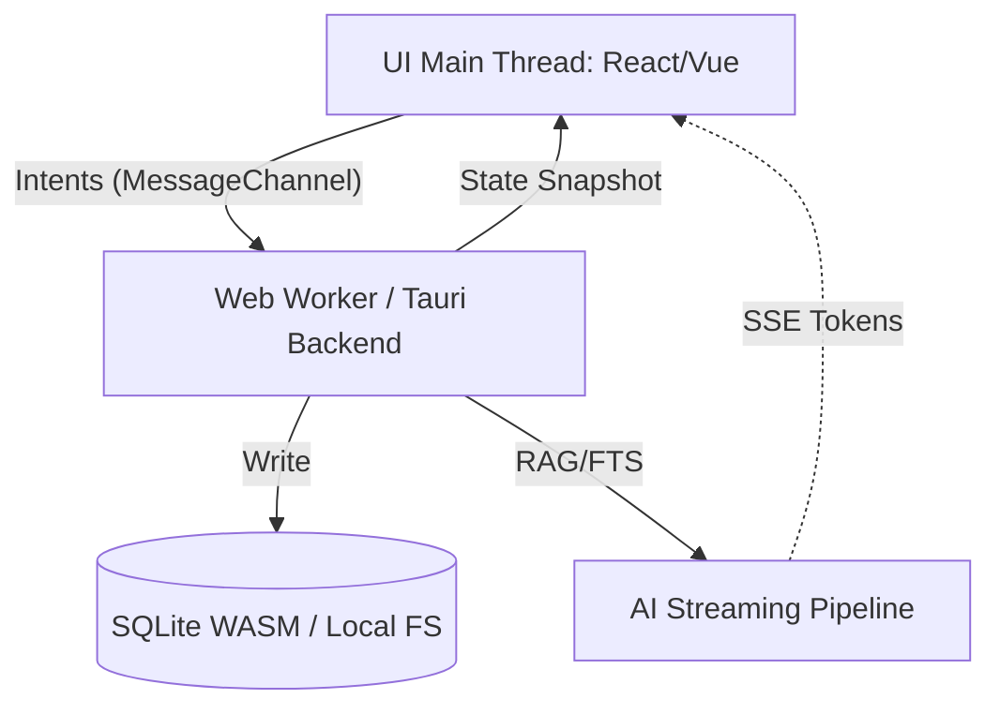

# TECH-05.2: Final App Specification — Core Engine & Architecture

## 1. Final System Architecture
El núcleo del sistema ("The Muscle") se diseña bajo la estricta directriz **Off-Main-Thread**. La pintura DOM (UI) y las transacciones pesadas jamás comparten el mismo hilo de ejecución cerebral.

### Diagrama Topológico (Flujo Asíncrono)

## 2. Entity Relationship & Data Model 
La BBDD relacional es optimizada para capturar el lore como un tejido de nodos:
- **`Project`**: Contenedor maestro local (Directorio / Virtual File System).
- **`CollectionTab`**: Segmentos ("Personajes", "Capítulos") que dictan el *PromptProfile* AI a utilizar.
- **`Entity`**: Nodos atómicos (ID, Title, Markdown Body).
- **`Relation`**: Aristas tipadas entre Entities, alimentando al motor gráfico WebGL.
- **`ChangeEvent`**: Estructura Append-Only. Un inmutable historial de mutaciones, cimiento del "Motor del Tiempo" y futura sincronía CRDT en Cloud.

## 3. API Contract Strategy (Zero-Latency Perception)
El paradigma es **Event Sourcing con Optimistic UI**:
1. El usuario modifica un *Entity*.
2. La UI "pinta" el cambio en el acto asumiendo verdad absoluta (latencia visual 0ms).
3. Se despacha un payload IPC ligero (`UPDATE_ENTITY`) al Back-End/Worker.
4. El Worker encolo el Write, actualiza el índice FTS5 (Full Text Search), inserta el log `ChangeEvent` y retorna un *ACK* silencioso de fondo.

## 4. Critical Component Deep Dive: Search & Persistence
### 4.1 FTS5 & El Lexer Engine (`{{}}`)
El autocompletado de entidades no corre filtros `Array.filter` en Javascript; delegamos en índices SQLite C-compiled re-generados pasivamente por el Worker. Al pulsar `{{`, el Query viaja por socket local y escupe sugerencias basadas en semántica y nombres alternativos (alias) sin trabar el *Framerate* UI. Modificar el título canónico en el futuro no rompe los enlaces porque la UI formatea el string usando los UUID subyacentes (`{Entity_Id}`).

### 4.2 Local-First Host Fallbacks
Las llamadas de almacenamiento abstraen su proveniencia:
- Si opera como Binario empaquetado (Tauri/OS), invoca FFI nativo al FileSystem.
- Si opera en navegador, decae a OPFS (Origin Private File System) aislando assets de decenas de MB sin conversiones fatigosas base64.

## 5. Security Protocols 
Rechazo absoluto al archivo local `.env` plano. Llaves API (OpenAI/Locales) son asimiladas desde la UI, y almacenadas bajo cifrado simétrico robusto o integradas a los Password Managers / Keychains del Sistema Operativo Host vía APIs nativas.

***
**Impacto UX:** El autor jamás sentirá que está escribiendo sobre una base de datos masiva; la arquitectura de Worker aísla el sufrimiento computacional (60fps garantizados). El History tracking protege contra pérdidas irremediables por alucinaciones AI.
**Coste estimado de implementación:** Extraordinario (Engine). Escribir puentes IPC/Worker limpios y evitar race-conditions en una arquitectura de estado optimista es el principal escollo técnico de todo CTO.
